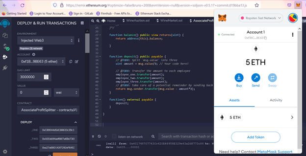
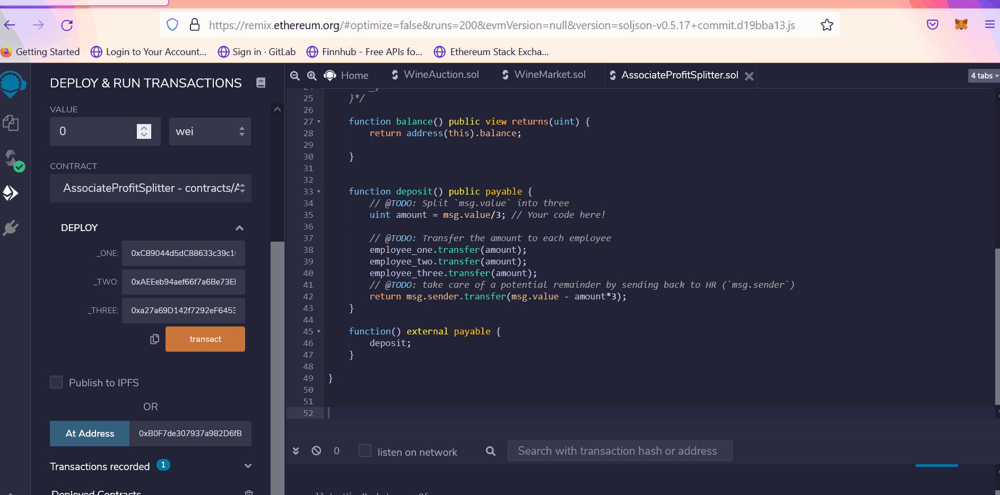
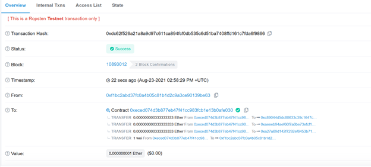

# Solidity_homework20

To efficiently pay employees of our new startup and to streamline administration of company finances, we have decided to leverage the Ethereum network.

To start, we have created three types of smart contracts:
- Contract One: Pay our Associate-level employees quickly and easily.
- Contract two: Distribute profits to different tiers of employees.
- Contract three: Distribute company shares for employees in a "deferred equity incentive plan" automatically.

## Contract One: AssociateProfitSplitter
This smart contract accepts Ether into the contract and divides the Ether evenly among the associate level employees -- allowing the Human Resources department to pay employees quickly and efficiently.

### Requirements
- Meta mask wallet loaded with ETH to distribute to associate-level employees

### Testing
The below is a demonstration of Contract One deployed on the Ropsten Test Network

- Contract One address: 0xecEd074D3B877EB47F41cC983Fcb1e13B0aFe030

- Pre-transfer

- Transaction execution

- Transaction confirmation

